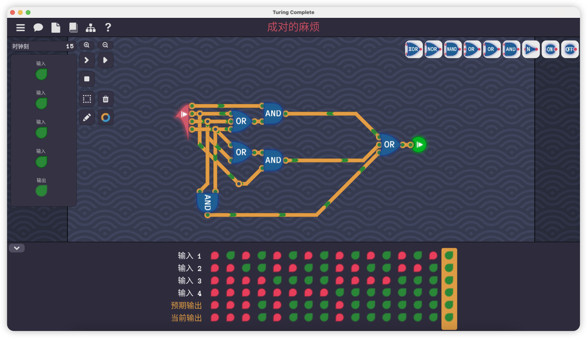
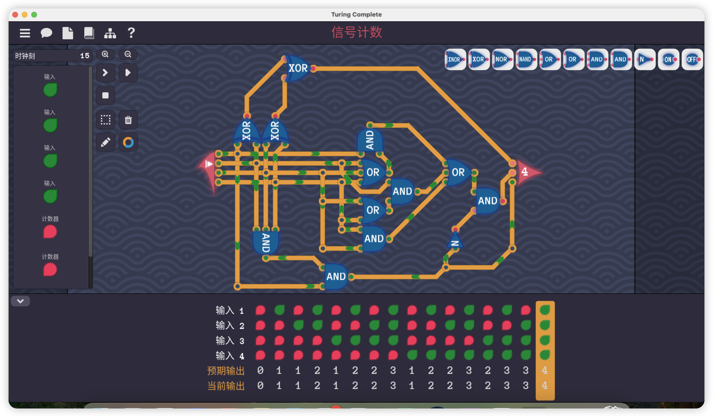
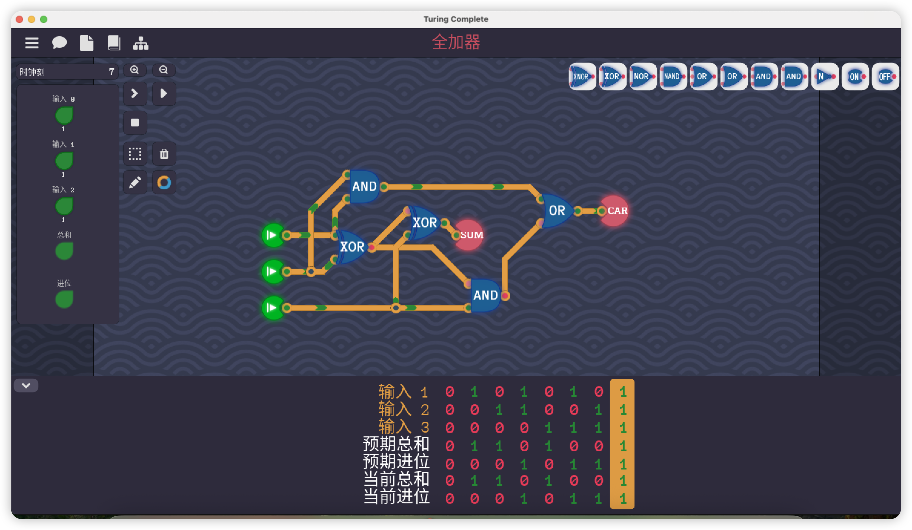

### 成对的麻烦 

4个输入，有2个或2个以上True，输出True

```
Y = A(B+C+D) + B(C+D) + CD
```




### 信号计数

```
Y1 = A xor B xor C xor D
Y2 = A(B+C+D) + B(C+D) + CD - ABCD
Y4 = ABCD
```




### 全加器

```
SUM = A xor B xor C
CAR = AB + (A xor B)C
```

